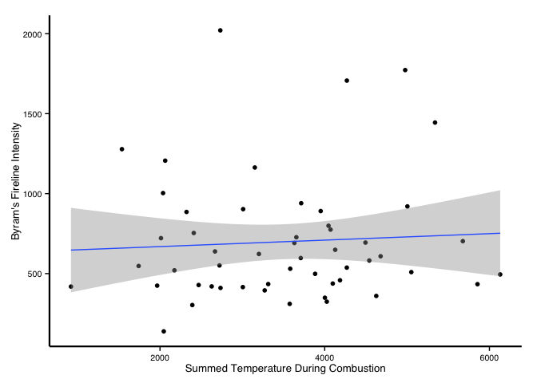
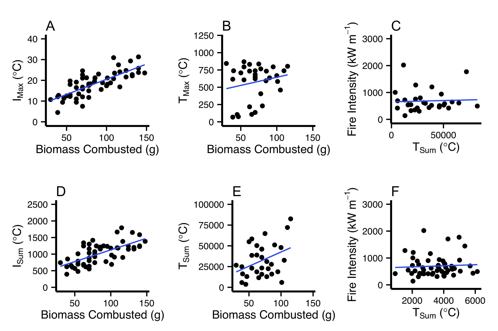

Analysis of Trial Data for
======================================================
_A NOVEL METHOD FOR QUANTIFYING SAVANNA FIRE INTENSITY UNDER FIELD CONDITIONS_
======================================================

Preliminary Work
----------

# Load Packages

```r
library(ggplot2)
library(lubridate)
library(jpeg)
library(png)
library(plyr)
library(reshape2)
library(gridExtra)
library(scales)
library(texreg)
library(ggthemes)
library(extrafont)

myTheme <- theme_tufte() +
  theme(
    text = element_text(family="sans",size=10),
    axis.line = element_line(size = .8)
  )
```
# Set Working Directory
This will need to be changed to wherever you save this.

```r
setwd("/Users/danielgodwin/Dropbox/Graduate School/Dissertation/Chapter 1 - Fire Temperature/Calibration/NovelMethod_Data/")
```
# Data Files
Place these files into a folder called "Data/"

Raw iButton Data (Data/iButtons)
* day1_212.csv
* day1_b33_control.csv
* `day1_r23.csv`
* `day1_s02.csv`
* `day1_t3k.csv`
* `day1_t8f.csv`
* `day1_212.csv`
* `day2_b33_control.csv`
* `day2_r23.csv`
* `day2_so2.csv`
* `day2_t3k_.csv`
* `day2_t8f.csv`
* `day3_212_control.csv`
* `day3_220.csv`
* `day3_229K.csv`
* `day3_b33.csv`
* `day3_g16.csv`
* `day3_r23.csv`
* `day3_s02.csv`
* `day3_t3k.csv`
* `day3_t48.csv`
* `day3_t8f.csv`

Raw Thermocouple Data (Data/Thermocouple)
* `1-October_calibration.csv`
* `3-October_calibration.csv`

# Load ancillary functions

The scripts `read_temperature_functions.R` and `temperature_parsing.R` should be placed in a directory called "Scripts"


```r
source(file = "Scripts/read_temperature_functions.R")
```


```r
source(file = "Scripts/temperature_parsing.R")
```
# Use the above functions to load the data

The functions `read.hobo` and `read.ibutton` are useful tools for reading in iButton data and Hobo-brand thermocouple data.


```r
day1_212 <- read.ibutton("Data/iButtons/day1_212.csv")
day1_r23 <- read.ibutton("Data/iButtons/day1_r23.csv")
day1_s02 <- read.ibutton("Data/iButtons/day1_s02.csv")
day1_t8f <- read.ibutton("Data/iButtons/day1_t8f.csv")
day1_t3k <- read.ibutton("Data/iButtons/day1_t3k.csv")
day1_control <- read.ibutton("Data/iButtons/day1_b33_control.csv")

day2_212 <- read.ibutton("Data/iButtons/day2_212.csv")
day2_control <- read.ibutton("Data/iButtons/day2_b33_control.csv")
day2_r23 <- read.ibutton("Data/iButtons/day2_r23.csv")
day2_s02 <- read.ibutton("Data/iButtons/day2_s02.csv")
day2_t3k <- read.ibutton("Data/iButtons/day2_t3k.csv")
day2_t8f <- read.ibutton("Data/iButtons/day2_t8f.csv")

day3_control <- read.ibutton("Data/iButtons/day3_212_control.csv")
day3_220 <- read.ibutton("Data/iButtons/day3_220.csv")
day3_229k <- read.ibutton("Data/iButtons/day3_229K.csv")
day3_b33 <- read.ibutton("Data/iButtons/day3_b33.csv")
day3_g16 <- read.ibutton("Data/iButtons/day3_g16.csv")
day3_r23 <- read.ibutton("Data/iButtons/day3_r23.csv")
day3_s02 <- read.ibutton("Data/iButtons/day3_s02.csv")
day3_t3k <- read.ibutton("Data/iButtons/day3_t3k.csv")
day3_t48 <- read.ibutton("Data/iButtons/day3_t48.csv")
day3_t84 <- read.ibutton("Data/iButtons/day3_t84.csv")
day3_t8f <- read.ibutton("Data/iButtons/day3_t8f.csv")

day1_thermo <- na.omit(read.hobo(HoboFile = "Data/Thermocouple/1-October_calibration.csv"))
day3_thermo <- na.omit(read.hobo(HoboFile = "Data/Thermocouple/3-October_calibration.csv"))


calibrationData <- read.csv("Data/2014_calibration_data.csv",
                            na.strings="-9999"
                            )
```
# Parse the lookup table.

Lookup table dates and times have to be define.

```r
calibrationData$Date <- dmy(calibrationData$Date)
calibrationData$Time_Start_hms <- hms(calibrationData$Time_Start_hms)
calibrationData$Next_Time_Start_hms <- hms(calibrationData$Next_Time_Start_hms)
calibrationData$End_Time_Start_hms <- hms(calibrationData$End_Time_Start_hms)

calibrationData$FlameTime_seconds <- as.numeric(calibrationData$FlameTime_seconds)

calibrationData$Start_DateTime <- ymd_hms(paste(calibrationData$Date,calibrationData$Time_Start_hms))

calibrationData$End_DateTime <- ymd_hms(paste(calibrationData$Date,calibrationData$End_Time_Start_hms))

calibrationData$Next_Start_DateTime <- ymd_hms(paste(calibrationData$Date,calibrationData$Next_Time_Start_hms))


tz(calibrationData$Start_DateTime) <- "Africa/Johannesburg"
tz(calibrationData$End_DateTime) <- "Africa/Johannesburg"
tz(calibrationData$Next_Start_DateTime) <- "Africa/Johannesburg"

# Removed for saturation
calibrationData <- subset(calibrationData,Trial_Number != "12")
calibrationData <- subset(calibrationData,Trial_Number != "55")

# Removed for sensor error.
calibrationData <- subset(calibrationData,Trial_Number != "54")
```
# Merge the data by time to be able to compare the temperature methods

```r
day1_212$iButton_Number <- "212"
day1_control$iButton_Number <- "B33"
day1_t3k$iButton_Number <- "T3K"
day1_t8f$iButton_Number <- "T8F"
day1_s02$iButton_Number <- "S02"
day1_r23$iButton_Number <- "R23"

day1_ibuttons <- rbind(day1_212,day1_control)
day1_ibuttons <- rbind(day1_ibuttons,day1_t3k)
day1_ibuttons <- rbind(day1_ibuttons,day1_t8f)
day1_ibuttons <- rbind(day1_ibuttons,day1_s02)
day1_ibuttons <- rbind(day1_ibuttons,day1_r23)


day1_ibuttons$Date <- dmy(1102014)

day2_212$iButton_Number <- "212"
day2_control$iButton_Number <- "B33"
day2_t3k$iButton_Number <- "T3K"
day2_t8f$iButton_Number <- "T8F"
day2_s02$iButton_Number <- "S02"
day2_r23$iButton_Number <- "R23"

day2_ibuttons <- rbind(day2_212,day2_control)
day2_ibuttons <- rbind(day2_ibuttons,day2_t3k)
day2_ibuttons <- rbind(day2_ibuttons,day2_t8f)
day2_ibuttons <- rbind(day2_ibuttons,day2_s02)
day2_ibuttons <- rbind(day2_ibuttons,day2_r23)

day2_ibuttons$Date <- dmy(02102014)

day3_220$iButton_Number <- "220"
day3_229k$iButton_Number <- "229K"
day3_b33$iButton_Number <- "B33"
day3_control$iButton_Number <- "S212"
day3_g16$iButton_Number <- "G16"
day3_r23$iButton_Number <- "R23"
day3_s02$iButton_Number <- "S02"
day3_t3k$iButton_Number <- "T3K"
day3_t48$iButton_Number <- "T48"
day3_t84$iButton_Number <- "T84"
day3_t8f$iButton_Number <- "T8F"

day3_ibuttons <- rbind(day3_220,day3_229k)
day3_ibuttons <- rbind(day3_ibuttons,day3_b33)
day3_ibuttons <- rbind(day3_ibuttons,day3_control)
day3_ibuttons <- rbind(day3_ibuttons,day3_g16)
day3_ibuttons <- rbind(day3_ibuttons,day3_r23)
day3_ibuttons <- rbind(day3_ibuttons,day3_s02)
day3_ibuttons <- rbind(day3_ibuttons,day3_t3k)
day3_ibuttons <- rbind(day3_ibuttons,day3_t48)
day3_ibuttons <- rbind(day3_ibuttons,day3_t84)
day3_ibuttons <- rbind(day3_ibuttons,day3_t8f)

day3_ibuttons$Date <- dmy(03102014)

tz(day1_ibuttons$Time) <- "Africa/Johannesburg"
tz(day2_ibuttons$Time) <- "Africa/Johannesburg"
tz(day3_ibuttons$Time) <- "Africa/Johannesburg"

day1_merge <- merge(day1_ibuttons,calibrationData,by=c("Date","iButton_Number"))
day1_begin <- min(day1_merge$Start_DateTime,na.rm=TRUE)
day1_end <- max(day1_merge$End_DateTime,na.rm=TRUE)
day1_int <- new_interval(day1_begin, day1_end)

day1_merge <- day1_merge[day1_merge$Time %within% day1_int,]


day2_merge <- merge(day2_ibuttons,calibrationData,by=c("Date","iButton_Number"))
day2_begin <- min(day2_merge$Start_DateTime,na.rm=TRUE)
day2_end <- max(day2_merge$End_DateTime,na.rm=TRUE)
day2_int <- new_interval(day2_begin, day2_end)
day2_merge <- day2_merge[day2_merge$Time %within% day2_int,]

day3_merge <- merge(day3_ibuttons,calibrationData,by=c("Date","iButton_Number"))
day3_begin <- min(day3_merge$Start_DateTime,na.rm=TRUE)
day3_end <- max(day3_merge$End_DateTime,na.rm=TRUE)
day3_int <- new_interval(day3_begin, day3_end)
day3_merge <- day3_merge[day3_merge$Time %within% day3_int,]

iButtonMerge_calibration <- rbind(day1_merge,day2_merge)
iButtonMerge_calibration <- rbind(iButtonMerge_calibration,day3_merge)

remove(list=c("day1_212","day1_control","day1_merge","day1_ibuttons","day1_r23","day1_s02","day1_t3k","day1_t8f","day2_212","day2_control","day2_ibuttons","day2_merge","day2_r23","day2_s02","day2_t3k","day2_t8f","day3_220","day3_229k","day3_b33","day3_control","day3_ibuttons","day3_g16","day3_merge","day3_r23","day3_s02","day3_t3k","day3_t48","day3_t84","day3_t8f"))

iButtonMerge_control <- subset(iButtonMerge_calibration,Trial_Number == "Control")
iButtonMerge_calibration <- subset(iButtonMerge_calibration,Trial_Number != "Control")

iButtonMerge_control$Trial_Number <- as.character(iButtonMerge_control$Trial_Number)

subTimeFxn <- function(dataf,calib_DF,TrialNumber_given){
  scratch <- subset(calib_DF,Trial_Number == TrialNumber_given)
#  interval_of_interest <- new_interval(scratch$Start_DateTime,scratch$End_DateTime-minutes(5))
  interval_of_interest <- new_interval(scratch$Start_DateTime,scratch$Start_DateTime+minutes(30))
  intermediate2 <- subset(dataf, Trial_Number == TrialNumber_given)
  intermediate <- intermediate2[intermediate2$Time %within% interval_of_interest,]
  return(intermediate)
}

dummyDF_to_fill <- data.frame("Trial_Number"= character(), "Time" = character(), "Temperature" = numeric())
colNamesToKeep = c("Trial_Number","Time","Temperature")

for(k in unique(calibrationData$Trial_Number)){
  subsetDF <- subTimeFxn(iButtonMerge_calibration,calib_DF = calibrationData,TrialNumber_given = k)
  
  interDF <- subsetDF[colNamesToKeep]
  interDF$Trial_Number <- as.character(interDF$Trial_Number)
  interDF$Time <- as.character(interDF$Time)
  dummyDF_to_fill <- rbind(dummyDF_to_fill,interDF)
}
#qplot(data = dummyDF_to_fill, x = Time, y = Temperature)+facet_wrap(~Trial_Number,scales = "free_x")

dummyDF_to_fill$Time <- ymd_hms(dummyDF_to_fill$Time)
tz(dummyDF_to_fill$Time) <- "Africa/Johannesburg"

tz(iButtonMerge_control$Time) <- "Africa/Johannesburg"
iButtonMerge_calibration <- merge(iButtonMerge_calibration,dummyDF_to_fill,all.y = TRUE)

# Now let's do it again for the iButton Controls

 subTimeFxn <- function(dataf,calib_DF,TrialNumber_given){
   scratch <- subset(calib_DF,Trial_Number == TrialNumber_given)
#   interval_of_interest <- new_interval(scratch$Start_DateTime,scratch$End_DateTime-minutes(5))

interval_of_interest <- new_interval(scratch$Start_DateTime,scratch$Start_DateTime+minutes(30))
   intermediate <- dataf[dataf$Time %within% interval_of_interest,]
   return(intermediate)
}
 
dummyDF_to_fill_control <- data.frame("Trial_Number"= character(),
                                      "Time" = character(),
                                      "Temperature" = numeric())

caliNotControl <- subset(calibrationData,Trial_Number != "Control")

 for(k in unique(caliNotControl$Trial_Number)){
   subsetDF <- subTimeFxn(iButtonMerge_control,calib_DF = caliNotControl,TrialNumber_given = k)
   interDF <- subsetDF[colNamesToKeep]

   
   if(nrow(interDF) > 0){
      interDF$Trial_Number <- k
      interDF$Time <- as.character(interDF$Time)
      dummyDF_to_fill_control <- rbind(dummyDF_to_fill_control,interDF)}
 }

toMerge <- ddply(dummyDF_to_fill_control,.(Trial_Number),summarize,meanControlTemp = mean(Temperature,na.omit=TRUE))

 iButtonMerge_calibration <- merge(iButtonMerge_calibration,
                                   toMerge,
                                   by = "Trial_Number",
                                   all.x = TRUE)
 
 iButtonMerge_calibration$Temperature = iButtonMerge_calibration$Temperature -  iButtonMerge_calibration$meanControlTemp
```


```r
day1_thermo$Date <- dmy(1102014)
day3_thermo$Date <- dmy(3102014)

thermoMerge <- rbind(day1_thermo,day3_thermo)
tz(thermoMerge$Time) <- "Africa/Johannesburg"
#thermoMerge <- subset(thermoMerge,Temperature > 0 & Temperature < 2000)
thermoMerge <- subset(thermoMerge,Temperature > 0)

thermoMerge$Trial_Number <- 0
subTimeFxn <- function(dataf,calib_DF,TrialNumber_given){
  scratch <- subset(calib_DF,Trial_Number == TrialNumber_given)
  interval_of_interest <- new_interval(scratch$Start_DateTime,scratch$Next_Start_DateTime-minutes(1))
  intermediate <- dataf[dataf$Time %within% interval_of_interest,]
  return(intermediate)
}

dummyDF_to_fill <- data.frame("Trial_Number"= character(), "Time" = character(), "Temperature" = numeric())
colNamesToKeep = c("Trial_Number","Time","Temperature")

for(k in unique(calibrationData$Trial_Number)){
  if(k != "Control"){
  subsetDF <- subTimeFxn(thermoMerge,calib_DF = calibrationData,TrialNumber_given = k)}
  
  interDF <- subsetDF[colNamesToKeep]
  if(nrow(interDF) > 0){
    interDF$Trial_Number <- k
    interDF$Time <- as.character(interDF$Time)
    dummyDF_to_fill <- rbind(dummyDF_to_fill,interDF)
    }
  
}
#qplot(data=dummyDF_to_fill, x = Time, y = Temperature) + facet_wrap(~Trial_Number, scales = "free_x")

thermoMerge <- dummyDF_to_fill

thermoMerge$Time <- ymd_hms(thermoMerge$Time, tz="Africa/Johannesburg")

thermoMerge$Trial_Number <- as.factor(thermoMerge$Trial_Number)
```

# Load and Process Weather Data

```r
wx1 <- read.csv("Data/Weather/X20140930A.csv",
                skip = 0)
wx2 <- read.csv("Data/Weather/X20141001A.csv")
wx3 <- read.csv("Data/Weather/X20141003A.csv")
wx4 <- read.csv("Data/Weather/X20141003A_2.csv")

wx1 <- wx1[-1,]
wx2 <- wx2[-1,]
wx3 <- wx3[-1,]        
wx4 <- wx4[-1,]

wx1$RH <- as.numeric(as.character(wx1$RH))
wx2$RH <- as.numeric(as.character(wx2$RH))
wx3$RH <- as.numeric(as.character(wx3$RH))
wx4$RH <- as.numeric(as.character(wx4$RH))

wx1$WS <- as.numeric(as.character(wx1$WS))
wx2$WS <- as.numeric(as.character(wx2$WS))
wx3$WS <- as.numeric(as.character(wx3$WS))
wx4$WS <- as.numeric(as.character(wx4$WS))

wx1$TP <- as.numeric(as.character(wx1$TP))
wx2$TP <- as.numeric(as.character(wx2$TP))
wx3$TP <- as.numeric(as.character(wx3$TP))
wx4$TP <- as.numeric(as.character(wx4$TP))

weatherAll <- rbind(wx1,wx2)
weatherAll <- rbind(weatherAll,wx3)
weatherAll <- rbind(weatherAll,wx4)


weatherAll$FORMATTED.DATE.TIME <- ymd_hms(weatherAll$FORMATTED.DATE.TIME, tz="Africa/Johannesburg")

weatherAll_subset <- subset(weatherAll, FORMATTED.DATE.TIME >= min(iButtonMerge_calibration$Time))

weatherAll_subset <- subset(weatherAll_subset, FORMATTED.DATE.TIME <= max(iButtonMerge_calibration$Time))


weatherAll_subset$Trial_Number <- 0
weatherAll_subset$Time <- weatherAll_subset$FORMATTED.DATE.TIME
#weatherAll_subset$FORMATTED.DATE.TIME <- NULL

subTimeFxn <- function(dataf,calib_DF,TrialNumber_given){
  scratch <- subset(calib_DF,Trial_Number == TrialNumber_given)
  interval_of_interest <- new_interval(scratch$Start_DateTime,
                                       scratch$Next_Start_DateTime - minutes(1))
  intermediate <- dataf[dataf$Time %within% interval_of_interest,]
  return(intermediate)
}

dummyDF_to_fill <- data.frame("Trial_Number"= character(),
                              "Time" = character(),
                              "WS" = numeric(),
                              "RH" = numeric(),
                              "TP" = numeric())

colNamesToKeep = c("Time","WS","RH","TP")

for(k in unique(calibrationData$Trial_Number)){
  if(k != "Control"){
  subsetDF <- subTimeFxn(weatherAll_subset,
                         calib_DF = calibrationData,
                         TrialNumber_given = k)}
  interDF <- subsetDF
  #interDF <- subsetDF[colNamesToKeep]
  
  if(nrow(interDF) > 0){
    
    interDF$Trial_Number <- k
    interDF$Time <- as.character(interDF$Time)
    dummyDF_to_fill <- rbind(dummyDF_to_fill,interDF)
    }
  
}

weatherAll_subset <- dummyDF_to_fill

weatherAll_subset$DT <- as.numeric(as.character(weatherAll_subset$WS))
weatherAll_subset$TP <- as.numeric(as.character(weatherAll_subset$TP))
weatherAll_subset$RH <- as.numeric(as.character(weatherAll_subset$RH))
weatherAll_subset$WS <- as.numeric(as.character(weatherAll_subset$WS))

weatherAll_subset$Trial_Number <- as.factor(weatherAll_subset$Trial_Number)

weatherAggregate <- ddply(.data = weatherAll_subset,
                          .variables = .(Trial_Number),
                          .fun = summarise,
                          RH_mean = mean(RH, na.rm = TRUE),
                          RH_min = min(RH, na.rm = TRUE),
                          RH_max = max(RH, na.rm = TRUE),
                          WS_mean = mean(WS, na.rm = TRUE),
                          WS_min = min(WS, na.rm = TRUE),
                          WS_max = max(WS, na.rm = TRUE),
                          TP_mean = mean(TP, na.rm = TRUE))

calibrationData <- merge(calibrationData,weatherAggregate,by = "Trial_Number",all.x = TRUE)

#remove(list=c("weatherAll","weatherAll_subset","wx1","wx2","wx3","wx4"))
```
# Process and merge data

```r
#downSampled <- merge(iButtonMerge_calibration,thermoMerge,by="Trial_Number")
#names(downSampled)[2] <- "Time"
#names(downSampled)[3] <- "iButtonTemperature"
#downSampled$Time.y <- NULL
#names(downSampled)[18] <- "thermoTemperature"


downSampled_iButton <- ddply(iButtonMerge_calibration,
              .(Trial_Number),
              summarize,
              maxTemp_i = max(Temperature),
              sumTemp_i = sum(Temperature),
              rangeTemp_i = max(Temperature) - min(Temperature)
              )


downSampled_thermo <- ddply(thermoMerge,
              .(Trial_Number),
              summarize,
              maxTemp_t = max(Temperature),
              sumTemp_t = sum(Temperature),
              rangeTemp_t = max(Temperature) - min(Temperature))


downSampled_thermo <- subset(downSampled_thermo,Trial_Number != "Control")

maxSub_i <- max_subset(dframe = iButtonMerge_calibration,tempvar = iButtonMerge_calibration$Temperature,time = iButtonMerge_calibration$Time,PlotID = iButtonMerge_calibration$Trial_Number)


maxSub_sub_i<- ddply(maxSub_i,
              .(PlotID),
              summarize,
              maxTemp_subset_iButton = max(Temp),
              rangeTemp_subset_iButton = max(Temp) - min(Temp),
              sumTemp_subset_iButton = sum(Temp))

maxSub_sub_i <- subset(maxSub_sub_i,PlotID != "Control")

names(maxSub_sub_i) <- c("PlotID","maxTemp_subset_iButton","rangeTemp_subset_iButton","sumTemp_subset_iButton")

downSampled_sub <- merge(downSampled_iButton,downSampled_thermo,by="Trial_Number",all.x = TRUE)

maxSub_sub <- merge(maxSub_sub_i,downSampled_sub,by.x="PlotID",by.y="Trial_Number")
#maxSub_sub <- merge(maxSub_sub_t,maxSub_sub,by="PlotID")

#maxSub_sub$maxTemp.y <- NULL
#maxSub_sub$rangeTemp.y <- NULL

#names(maxSub_sub) <- c("Trial_Number","maxTemp","rangeTemp","sumTempPeak","sumTempAll","Intensity")
IntensityCalcs <- calibrationData

PlotSize <- 1/4
HeatYield <- 16890 / 100
RateOfSpread <- PlotSize / (IntensityCalcs$FlameTime_seconds + IntensityCalcs$SmoulderingTime_seconds)
GramsConsumed <- IntensityCalcs$FuelLoad_g / PlotSize^2

IntensityCalcs$Intensity <- HeatYield * GramsConsumed * RateOfSpread

reMergeAnalysis <- merge(maxSub_sub,IntensityCalcs,by.x="PlotID",by.y="Trial_Number")

#reMergeAnalysis$Intensity2 <- 2729 + 0.8684 * reMergeAnalysis$FuelLoad_g - 530 * sqrt(11) - 0.907 * reMergeAnalysis$RH_mean^2 - 569 * 1/reMergeAnalysis$WS_mean
```
# Exploratory Visualizations

## Fuel Loading Effects

        

## Relationships with Byram's Intensity

       

## Relationships with Weather Variables

            

## Relationships between iButton and Thermocouple

     

```
## mapping: x = sumTemp_subset_iButton, y = sumTemp_t 
## geom_smooth:  
## stat_smooth: method = lm 
## position_identity: (width = NULL, height = NULL)
```

## iButton Residual ~ Weather Analysis

Calculate residuals of lm

```r
testResidsDF_i <- reMergeAnalysis
testResidsDF_tc <- subset(reMergeAnalysis, !is.na(maxTemp_t))

testResidsDF_i$iButton_resids <- residuals(maxTemp_by_FuelLoad_iButton)
testResidsDF_tc$thermocouple_resids <- residuals(maxTemp_by_FuelLoad_thermocouple)
```

## Thermocouple Residual ~ Weather Analysis


  
 


```r
TCresids_by_RHmean <- lm(thermocouple_resids ~ RH_mean, testResidsDF_tc)
summary(TCresids_by_RHmean)
```

```
## 
## Call:
## lm(formula = thermocouple_resids ~ RH_mean, data = testResidsDF_tc)
## 
## Residuals:
##    Min     1Q Median     3Q    Max 
## -454.0 -189.0   70.3  164.9  381.8 
## 
## Coefficients:
##             Estimate Std. Error t value Pr(>|t|)
## (Intercept)   29.014    104.284    0.28     0.78
## RH_mean       -0.806      2.605   -0.31     0.76
## 
## Residual standard error: 258 on 30 degrees of freedom
## Multiple R-squared:  0.00318,	Adjusted R-squared:  -0.03 
## F-statistic: 0.0957 on 1 and 30 DF,  p-value: 0.759
```

 


```r
TCresids_by_WSmean <- lm(thermocouple_resids ~ WS_mean, testResidsDF_tc)
summary(TCresids_by_WSmean)
```

```
## 
## Call:
## lm(formula = thermocouple_resids ~ WS_mean, data = testResidsDF_tc)
## 
## Residuals:
##    Min     1Q Median     3Q    Max 
## -445.4 -192.7   60.7  175.5  395.0 
## 
## Coefficients:
##             Estimate Std. Error t value Pr(>|t|)
## (Intercept)   -104.1       91.0   -1.14     0.26
## WS_mean         57.4       43.8    1.31     0.20
## 
## Residual standard error: 251 on 30 degrees of freedom
## Multiple R-squared:  0.0542,	Adjusted R-squared:  0.0226 
## F-statistic: 1.72 on 1 and 30 DF,  p-value: 0.2
```

 


```r
TCresids_by_WSmax <- lm(thermocouple_resids ~ WS_max, testResidsDF_tc)
summary(TCresids_by_WSmax)
```

```
## 
## Call:
## lm(formula = thermocouple_resids ~ WS_max, data = testResidsDF_tc)
## 
## Residuals:
##    Min     1Q Median     3Q    Max 
## -473.8 -190.1   60.6  166.6  383.6 
## 
## Coefficients:
##             Estimate Std. Error t value Pr(>|t|)
## (Intercept)    -79.6       91.5   -0.87     0.39
## WS_max          25.1       25.1    1.00     0.33
## 
## Residual standard error: 254 on 30 degrees of freedom
## Multiple R-squared:  0.0322,	Adjusted R-squared:  -3.05e-05 
## F-statistic: 0.999 on 1 and 30 DF,  p-value: 0.326
```

 


```r
TCresids_by_RHmin <- lm(thermocouple_resids ~ RH_min, testResidsDF_tc)
summary(TCresids_by_RHmin)
```

```
## 
## Call:
## lm(formula = thermocouple_resids ~ RH_min, data = testResidsDF_tc)
## 
## Residuals:
##    Min     1Q Median     3Q    Max 
## -451.3 -190.0   70.9  167.1  377.8 
## 
## Coefficients:
##             Estimate Std. Error t value Pr(>|t|)
## (Intercept)   21.893    102.868    0.21     0.83
## RH_min        -0.625      2.630   -0.24     0.81
## 
## Residual standard error: 258 on 30 degrees of freedom
## Multiple R-squared:  0.00188,	Adjusted R-squared:  -0.0314 
## F-statistic: 0.0564 on 1 and 30 DF,  p-value: 0.814
```

## Plot thermocouple residuals


  

```
## Warning: Removed 20 rows containing missing values (stat_smooth).
## Warning: Removed 20 rows containing missing values (geom_point).
```

 


```r
IBresids_by_RHmean <- lm(iButton_resids ~ RH_mean, testResidsDF_i)
summary(IBresids_by_RHmean)
```

```
## 
## Call:
## lm(formula = iButton_resids ~ RH_mean, data = testResidsDF_i)
## 
## Residuals:
##    Min     1Q Median     3Q    Max 
## -8.354 -2.858 -0.057  2.875  7.813 
## 
## Coefficients:
##             Estimate Std. Error t value Pr(>|t|)
## (Intercept)  -1.0768     1.6034   -0.67     0.51
## RH_mean       0.0311     0.0395    0.79     0.44
## 
## Residual standard error: 3.97 on 32 degrees of freedom
##   (20 observations deleted due to missingness)
## Multiple R-squared:  0.0189,	Adjusted R-squared:  -0.0117 
## F-statistic: 0.618 on 1 and 32 DF,  p-value: 0.438
```


```
## Warning: Removed 20 rows containing missing values (stat_smooth).
## Warning: Removed 20 rows containing missing values (geom_point).
```

 


```r
IBresids_by_WSmean <- lm(iButton_resids ~ WS_mean, testResidsDF_i)
summary(IBresids_by_WSmean)
```

```
## 
## Call:
## lm(formula = iButton_resids ~ WS_mean, data = testResidsDF_i)
## 
## Residuals:
##    Min     1Q Median     3Q    Max 
##  -8.27  -2.69   0.08   3.13   7.83 
## 
## Coefficients:
##             Estimate Std. Error t value Pr(>|t|)
## (Intercept)    1.039      1.400    0.74     0.46
## WS_mean       -0.546      0.685   -0.80     0.43
## 
## Residual standard error: 3.97 on 32 degrees of freedom
##   (20 observations deleted due to missingness)
## Multiple R-squared:  0.0195,	Adjusted R-squared:  -0.0112 
## F-statistic: 0.635 on 1 and 32 DF,  p-value: 0.431
```


```
## Warning: Removed 20 rows containing missing values (stat_smooth).
## Warning: Removed 20 rows containing missing values (geom_point).
```

 


```r
IBresids_by_WSmax <- lm(iButton_resids ~ WS_max, testResidsDF_i)
summary(IBresids_by_WSmax)
```

```
## 
## Call:
## lm(formula = iButton_resids ~ WS_max, data = testResidsDF_i)
## 
## Residuals:
##    Min     1Q Median     3Q    Max 
## -8.623 -2.442  0.254  2.496  8.181 
## 
## Coefficients:
##             Estimate Std. Error t value Pr(>|t|)
## (Intercept)    0.479      1.420    0.34     0.74
## WS_max        -0.130      0.391   -0.33     0.74
## 
## Residual standard error: 4 on 32 degrees of freedom
##   (20 observations deleted due to missingness)
## Multiple R-squared:  0.00346,	Adjusted R-squared:  -0.0277 
## F-statistic: 0.111 on 1 and 32 DF,  p-value: 0.741
```


```
## Warning: Removed 20 rows containing missing values (stat_smooth).
## Warning: Removed 20 rows containing missing values (geom_point).
```

 


```r
IBresids_by_RHmin <- lm(iButton_resids ~ RH_min, testResidsDF_i)
summary(IBresids_by_RHmin)
```

```
## 
## Call:
## lm(formula = iButton_resids ~ RH_min, data = testResidsDF_i)
## 
## Residuals:
##    Min     1Q Median     3Q    Max 
##  -8.35  -2.87  -0.04   2.86   7.79 
## 
## Coefficients:
##             Estimate Std. Error t value Pr(>|t|)
## (Intercept)  -1.0614     1.5819   -0.67     0.51
## RH_min        0.0315     0.0400    0.79     0.44
## 
## Residual standard error: 3.97 on 32 degrees of freedom
##   (20 observations deleted due to missingness)
## Multiple R-squared:  0.019,	Adjusted R-squared:  -0.0116 
## F-statistic: 0.621 on 1 and 32 DF,  p-value: 0.436
```

# Figures for Analysis

## Figure 1

 

```
## NULL
```

## Figure 2

 

# Modelled Relationships


```r
#reMergeAnalysis$Duration <- reMergeAnalysis$FlameTime_seconds + reMergeAnalysis$SmoulderingTime_seconds

maxTemp_by_FuelLoad_iButton <- lm(maxTemp_subset_iButton ~ FuelLoad_g,data=reMergeAnalysis)
maxTemp_by_FuelLoad_thermocouple <- lm(maxTemp_t ~ FuelLoad_g,data=reMergeAnalysis)

a <- reMergeAnalysis[c("maxTemp_subset_iButton","maxTemp_t","FuelLoad_g")]
b <- melt(a,measure.vars = c("maxTemp_subset_iButton","maxTemp_t"))
names(b) <- c("FuelLoad_g","Method","Temperature")

c <- subset(b, Method == "maxTemp_subset_iButton")
d <- subset(b, Method == "maxTemp_t")


maxTemp_by_FuelLoad_iButton <- lm(Temperature ~ FuelLoad_g,data=c)
maxTemp_by_FuelLoad_thermocouple <- lm(Temperature ~ FuelLoad_g,data=d)
compareMethod <- lm(Temperature ~ FuelLoad_g + Method,data=b)

AIC(maxTemp_by_FuelLoad_iButton,maxTemp_by_FuelLoad_thermocouple)
```

```
## Warning: models are not all fitted to the same number of observations
```

```
##                                  df   AIC
## maxTemp_by_FuelLoad_iButton       3 303.6
## maxTemp_by_FuelLoad_thermocouple  3 450.2
```

```r
anova(compareMethod)
```

```
## Analysis of Variance Table
## 
## Response: Temperature
##            Df  Sum Sq Mean Sq F value Pr(>F)    
## FuelLoad_g  1  216383  216383    8.71 0.0041 ** 
## Method      1 6030971 6030971  242.87 <2e-16 ***
## Residuals  83 2061053   24832                   
## ---
## Signif. codes:  0 '***' 0.001 '**' 0.01 '*' 0.05 '.' 0.1 ' ' 1
```

```r
#maxTemp_by_iMaxXDuration <- lm(maxTemp_t ~ maxTemp_subset_iButton * WS_max,data=reMergeAnalysis)

sumTempPeak_by_FuelLoad <- lm(sumTemp_subset_iButton ~ FuelLoad_g, data=reMergeAnalysis)
sumTemp_by_FuelLoad_thermocouple <- lm(sumTemp_t ~ FuelLoad_g,data=reMergeAnalysis)


sumTemp_by_FuelLoad <- lm(sumTemp_i ~ FuelLoad_g, data=reMergeAnalysis)

Intensity_by_FuelLoad <- lm(Intensity ~ FuelLoad_g,data=reMergeAnalysis)
Intensity_by_iMax <- lm(Intensity ~ maxTemp_subset_iButton,data=reMergeAnalysis)
Intensity_by_sumTempPeak <- lm(Intensity ~ sumTemp_subset_iButton,data=reMergeAnalysis)
Intensity_by_sumTemp <- lm(Intensity ~ sumTemp_t,data=reMergeAnalysis)

maxTemp_by_maxTemp_subset_i <- lm(maxTemp_t ~ maxTemp_subset_iButton,data=reMergeAnalysis)
maxTemp_by_maxTemp_i <- lm(maxTemp_t ~ maxTemp_i,data=reMergeAnalysis)
maxTemp_by_maxTemp_i_x_sumTemp <- lm(maxTemp_t ~ maxTemp_i * sumTemp_subset_iButton,data=reMergeAnalysis)
maxTemp_bysumTempPeak <- lm(maxTemp_t ~ sumTemp_subset_iButton,data=reMergeAnalysis)
maxTemp_bysumTemp <- lm(maxTemp_t ~ sumTemp_i,data=reMergeAnalysis)
```


<html>
  <table cellspacing="0" style="border: none;">
    <caption align="bottom" style="margin-top:0.3em;">maxTemp ~ FuelLoad_g</caption>
    <tr>
      <th style="text-align: left; border-top: 2px solid black; border-bottom: 1px solid black; padding-right: 12px;"></th>
      <th style="text-align: left; border-top: 2px solid black; border-bottom: 1px solid black; padding-right: 12px;"><b>Imax ~ FuelLoad_g</b></th>
    </tr>
    <tr>
      <td style="padding-right: 12px; border: none;">(Intercept)</td>
      <td style="padding-right: 12px; border: none;">5.86 (1.57)<sup style="vertical-align: 4px;">\*\*\*</sup></td>
    </tr>
    <tr>
      <td style="padding-right: 12px; border: none;">FuelLoad_g</td>
      <td style="padding-right: 12px; border: none;">0.15 (0.02)<sup style="vertical-align: 4px;">\*\*\*</sup></td>
    </tr>
    <tr>
      <td style="border-top: 1px solid black;">R<sup style="vertical-align: 4px;">2</sup></td>
      <td style="border-top: 1px solid black;">0.58</td>
    </tr>
    <tr>
      <td style="padding-right: 12px; border: none;">Adj. R<sup style="vertical-align: 4px;">2</sup></td>
      <td style="padding-right: 12px; border: none;">0.57</td>
    </tr>
    <tr>
      <td style="border-bottom: 2px solid black;">Num. obs.</td>
      <td style="border-bottom: 2px solid black;">54</td>
    </tr>
    <tr>
      <td style="padding-right: 12px; border: none;" colspan="2"><span style="font-size:0.8em"><sup style="vertical-align: 4px;">\*\*\*</sup>p &lt; 0.001, <sup style="vertical-align: 4px;">\*\*</sup>p &lt; 0.01, <sup style="vertical-align: 4px;">\*</sup>p &lt; 0.05</span></td>
    </tr>
  </table>
</html>

<html>
  <table cellspacing="0" style="border: none;">
    <caption align="bottom" style="margin-top:0.3em;">maxTemp ~ FuelLoad_g</caption>
    <tr>
      <th style="text-align: left; border-top: 2px solid black; border-bottom: 1px solid black; padding-right: 12px;"></th>
      <th style="text-align: left; border-top: 2px solid black; border-bottom: 1px solid black; padding-right: 12px;"><b>Tmax ~ FuelLoad_g</b></th>
    </tr>
    <tr>
      <td style="padding-right: 12px; border: none;">(Intercept)</td>
      <td style="padding-right: 12px; border: none;">408.91 (153.53)<sup style="vertical-align: 4px;">\*</sup></td>
    </tr>
    <tr>
      <td style="padding-right: 12px; border: none;">FuelLoad_g</td>
      <td style="padding-right: 12px; border: none;">2.36 (2.08)</td>
    </tr>
    <tr>
      <td style="border-top: 1px solid black;">R<sup style="vertical-align: 4px;">2</sup></td>
      <td style="border-top: 1px solid black;">0.04</td>
    </tr>
    <tr>
      <td style="padding-right: 12px; border: none;">Adj. R<sup style="vertical-align: 4px;">2</sup></td>
      <td style="padding-right: 12px; border: none;">0.01</td>
    </tr>
    <tr>
      <td style="border-bottom: 2px solid black;">Num. obs.</td>
      <td style="border-bottom: 2px solid black;">32</td>
    </tr>
    <tr>
      <td style="padding-right: 12px; border: none;" colspan="2"><span style="font-size:0.8em"><sup style="vertical-align: 4px;">\*\*\*</sup>p &lt; 0.001, <sup style="vertical-align: 4px;">\*\*</sup>p &lt; 0.01, <sup style="vertical-align: 4px;">\*</sup>p &lt; 0.05</span></td>
    </tr>
  </table>
</html>

<html>
  <table cellspacing="0" style="border: none;">
    <tr>
      <th style="text-align: left; border-top: 2px solid black; border-bottom: 1px solid black; padding-right: 12px;"></th>
      <th style="text-align: left; border-top: 2px solid black; border-bottom: 1px solid black; padding-right: 12px;"><b>Isum-peak ~ FuelLoad_g</b></th>
    </tr>
    <tr>
      <td style="padding-right: 12px; border: none;">(Intercept)</td>
      <td style="padding-right: 12px; border: none;">421.33 (99.52)<sup style="vertical-align: 4px;">\*\*\*</sup></td>
    </tr>
    <tr>
      <td style="padding-right: 12px; border: none;">FuelLoad_g</td>
      <td style="padding-right: 12px; border: none;">7.06 (1.10)<sup style="vertical-align: 4px;">\*\*\*</sup></td>
    </tr>
    <tr>
      <td style="border-top: 1px solid black;">R<sup style="vertical-align: 4px;">2</sup></td>
      <td style="border-top: 1px solid black;">0.44</td>
    </tr>
    <tr>
      <td style="padding-right: 12px; border: none;">Adj. R<sup style="vertical-align: 4px;">2</sup></td>
      <td style="padding-right: 12px; border: none;">0.43</td>
    </tr>
    <tr>
      <td style="border-bottom: 2px solid black;">Num. obs.</td>
      <td style="border-bottom: 2px solid black;">54</td>
    </tr>
    <tr>
      <td style="padding-right: 12px; border: none;" colspan="2"><span style="font-size:0.8em"><sup style="vertical-align: 4px;">\*\*\*</sup>p &lt; 0.001, <sup style="vertical-align: 4px;">\*\*</sup>p &lt; 0.01, <sup style="vertical-align: 4px;">\*</sup>p &lt; 0.05</span></td>
    </tr>
  </table>
</html>

<html>
  <table cellspacing="0" style="border: none;">
    <tr>
      <th style="text-align: left; border-top: 2px solid black; border-bottom: 1px solid black; padding-right: 12px;"></th>
      <th style="text-align: left; border-top: 2px solid black; border-bottom: 1px solid black; padding-right: 12px;"><b>Isum ~ FuelLoad_g</b></th>
    </tr>
    <tr>
      <td style="padding-right: 12px; border: none;">(Intercept)</td>
      <td style="padding-right: 12px; border: none;">1421.37 (366.92)<sup style="vertical-align: 4px;">\*\*\*</sup></td>
    </tr>
    <tr>
      <td style="padding-right: 12px; border: none;">FuelLoad_g</td>
      <td style="padding-right: 12px; border: none;">24.18 (4.05)<sup style="vertical-align: 4px;">\*\*\*</sup></td>
    </tr>
    <tr>
      <td style="border-top: 1px solid black;">R<sup style="vertical-align: 4px;">2</sup></td>
      <td style="border-top: 1px solid black;">0.41</td>
    </tr>
    <tr>
      <td style="padding-right: 12px; border: none;">Adj. R<sup style="vertical-align: 4px;">2</sup></td>
      <td style="padding-right: 12px; border: none;">0.40</td>
    </tr>
    <tr>
      <td style="border-bottom: 2px solid black;">Num. obs.</td>
      <td style="border-bottom: 2px solid black;">54</td>
    </tr>
    <tr>
      <td style="padding-right: 12px; border: none;" colspan="2"><span style="font-size:0.8em"><sup style="vertical-align: 4px;">\*\*\*</sup>p &lt; 0.001, <sup style="vertical-align: 4px;">\*\*</sup>p &lt; 0.01, <sup style="vertical-align: 4px;">\*</sup>p &lt; 0.05</span></td>
    </tr>
  </table>
</html>


<table cellspacing="0" style="border: none;">
  <tr>
    <th style="text-align: left; border-top: 2px solid black; border-bottom: 1px solid black; padding-right: 12px;"></th>
    <th style="text-align: left; border-top: 2px solid black; border-bottom: 1px solid black; padding-right: 12px;"><b>Intensity ~ Isum(peak)</b></th>
  </tr>
  <tr>
    <td style="padding-right: 12px; border: none;">(Intercept)</td>
    <td style="padding-right: 12px; border: none;">713.67 (181.07)<sup style="vertical-align: 4px;">\*\*\*</sup></td>
  </tr>
  <tr>
    <td style="padding-right: 12px; border: none;">sumTemp_subset_iButton</td>
    <td style="padding-right: 12px; border: none;">-0.01 (0.17)</td>
  </tr>
  <tr>
    <td style="border-top: 1px solid black;">R<sup style="vertical-align: 4px;">2</sup></td>
    <td style="border-top: 1px solid black;">0.00</td>
  </tr>
  <tr>
    <td style="padding-right: 12px; border: none;">Adj. R<sup style="vertical-align: 4px;">2</sup></td>
    <td style="padding-right: 12px; border: none;">-0.02</td>
  </tr>
  <tr>
    <td style="border-bottom: 2px solid black;">Num. obs.</td>
    <td style="border-bottom: 2px solid black;">52</td>
  </tr>
  <tr>
    <td style="padding-right: 12px; border: none;" colspan="2"><span style="font-size:0.8em"><sup style="vertical-align: 4px;">\*\*\*</sup>p &lt; 0.001, <sup style="vertical-align: 4px;">\*\*</sup>p &lt; 0.01, <sup style="vertical-align: 4px;">\*</sup>p &lt; 0.05</span></td>
  </tr>
</table>

<table cellspacing="0" style="border: none;">
  <tr>
    <th style="text-align: left; border-top: 2px solid black; border-bottom: 1px solid black; padding-right: 12px;"></th>
    <th style="text-align: left; border-top: 2px solid black; border-bottom: 1px solid black; padding-right: 12px;"><b>Intensity ~ Isum</b></th>
  </tr>
  <tr>
    <td style="padding-right: 12px; border: none;">(Intercept)</td>
    <td style="padding-right: 12px; border: none;">653.18 (143.37)<sup style="vertical-align: 4px;">\*\*\*</sup></td>
  </tr>
  <tr>
    <td style="padding-right: 12px; border: none;">sumTemp_t</td>
    <td style="padding-right: 12px; border: none;">0.00 (0.00)</td>
  </tr>
  <tr>
    <td style="border-top: 1px solid black;">R<sup style="vertical-align: 4px;">2</sup></td>
    <td style="border-top: 1px solid black;">0.00</td>
  </tr>
  <tr>
    <td style="padding-right: 12px; border: none;">Adj. R<sup style="vertical-align: 4px;">2</sup></td>
    <td style="padding-right: 12px; border: none;">-0.03</td>
  </tr>
  <tr>
    <td style="border-bottom: 2px solid black;">Num. obs.</td>
    <td style="border-bottom: 2px solid black;">31</td>
  </tr>
  <tr>
    <td style="padding-right: 12px; border: none;" colspan="2"><span style="font-size:0.8em"><sup style="vertical-align: 4px;">\*\*\*</sup>p &lt; 0.001, <sup style="vertical-align: 4px;">\*\*</sup>p &lt; 0.01, <sup style="vertical-align: 4px;">\*</sup>p &lt; 0.05</span></td>
  </tr>
</table>


<table cellspacing="0" style="border: none;">
  <tr>
    <th style="text-align: left; border-top: 2px solid black; border-bottom: 1px solid black; padding-right: 12px;"></th>
    <th style="text-align: left; border-top: 2px solid black; border-bottom: 1px solid black; padding-right: 12px;"><b>Tmax ~ Imax</b></th>
  </tr>
  <tr>
    <td style="padding-right: 12px; border: none;">(Intercept)</td>
    <td style="padding-right: 12px; border: none;">288.82 (134.49)<sup style="vertical-align: 4px;">\*</sup></td>
  </tr>
  <tr>
    <td style="padding-right: 12px; border: none;">maxTemp_subset_iButton</td>
    <td style="padding-right: 12px; border: none;">17.67 (7.87)<sup style="vertical-align: 4px;">\*</sup></td>
  </tr>
  <tr>
    <td style="border-top: 1px solid black;">R<sup style="vertical-align: 4px;">2</sup></td>
    <td style="border-top: 1px solid black;">0.14</td>
  </tr>
  <tr>
    <td style="padding-right: 12px; border: none;">Adj. R<sup style="vertical-align: 4px;">2</sup></td>
    <td style="padding-right: 12px; border: none;">0.12</td>
  </tr>
  <tr>
    <td style="border-bottom: 2px solid black;">Num. obs.</td>
    <td style="border-bottom: 2px solid black;">32</td>
  </tr>
  <tr>
    <td style="padding-right: 12px; border: none;" colspan="2"><span style="font-size:0.8em"><sup style="vertical-align: 4px;">\*\*\*</sup>p &lt; 0.001, <sup style="vertical-align: 4px;">\*\*</sup>p &lt; 0.01, <sup style="vertical-align: 4px;">\*</sup>p &lt; 0.05</span></td>
  </tr>
</table>

<table cellspacing="0" style="border: none;">
  <tr>
    <th style="text-align: left; border-top: 2px solid black; border-bottom: 1px solid black; padding-right: 12px;"></th>
    <th style="text-align: left; border-top: 2px solid black; border-bottom: 1px solid black; padding-right: 12px;"><b>Tmax ~ Isum(peak)</b></th>
  </tr>
  <tr>
    <td style="padding-right: 12px; border: none;">(Intercept)</td>
    <td style="padding-right: 12px; border: none;">263.71 (130.40)</td>
  </tr>
  <tr>
    <td style="padding-right: 12px; border: none;">sumTemp_subset_iButton</td>
    <td style="padding-right: 12px; border: none;">0.33 (0.13)<sup style="vertical-align: 4px;">\*</sup></td>
  </tr>
  <tr>
    <td style="border-top: 1px solid black;">R<sup style="vertical-align: 4px;">2</sup></td>
    <td style="border-top: 1px solid black;">0.17</td>
  </tr>
  <tr>
    <td style="padding-right: 12px; border: none;">Adj. R<sup style="vertical-align: 4px;">2</sup></td>
    <td style="padding-right: 12px; border: none;">0.15</td>
  </tr>
  <tr>
    <td style="border-bottom: 2px solid black;">Num. obs.</td>
    <td style="border-bottom: 2px solid black;">32</td>
  </tr>
  <tr>
    <td style="padding-right: 12px; border: none;" colspan="2"><span style="font-size:0.8em"><sup style="vertical-align: 4px;">\*\*\*</sup>p &lt; 0.001, <sup style="vertical-align: 4px;">\*\*</sup>p &lt; 0.01, <sup style="vertical-align: 4px;">\*</sup>p &lt; 0.05</span></td>
  </tr>
</table>

<table cellspacing="0" style="border: none;">
  <tr>
    <th style="text-align: left; border-top: 2px solid black; border-bottom: 1px solid black; padding-right: 12px;"></th>
    <th style="text-align: left; border-top: 2px solid black; border-bottom: 1px solid black; padding-right: 12px;"><b>Tsum ~ Isum</b></th>
  </tr>
  <tr>
    <td style="padding-right: 12px; border: none;">(Intercept)</td>
    <td style="padding-right: 12px; border: none;">307.46 (123.83)<sup style="vertical-align: 4px;">\*</sup></td>
  </tr>
  <tr>
    <td style="padding-right: 12px; border: none;">sumTemp_i</td>
    <td style="padding-right: 12px; border: none;">0.08 (0.04)<sup style="vertical-align: 4px;">\*</sup></td>
  </tr>
  <tr>
    <td style="border-top: 1px solid black;">R<sup style="vertical-align: 4px;">2</sup></td>
    <td style="border-top: 1px solid black;">0.15</td>
  </tr>
  <tr>
    <td style="padding-right: 12px; border: none;">Adj. R<sup style="vertical-align: 4px;">2</sup></td>
    <td style="padding-right: 12px; border: none;">0.12</td>
  </tr>
  <tr>
    <td style="border-bottom: 2px solid black;">Num. obs.</td>
    <td style="border-bottom: 2px solid black;">32</td>
  </tr>
  <tr>
    <td style="padding-right: 12px; border: none;" colspan="2"><span style="font-size:0.8em"><sup style="vertical-align: 4px;">\*\*\*</sup>p &lt; 0.001, <sup style="vertical-align: 4px;">\*\*</sup>p &lt; 0.01, <sup style="vertical-align: 4px;">\*</sup>p &lt; 0.05</span></td>
  </tr>
</table>


