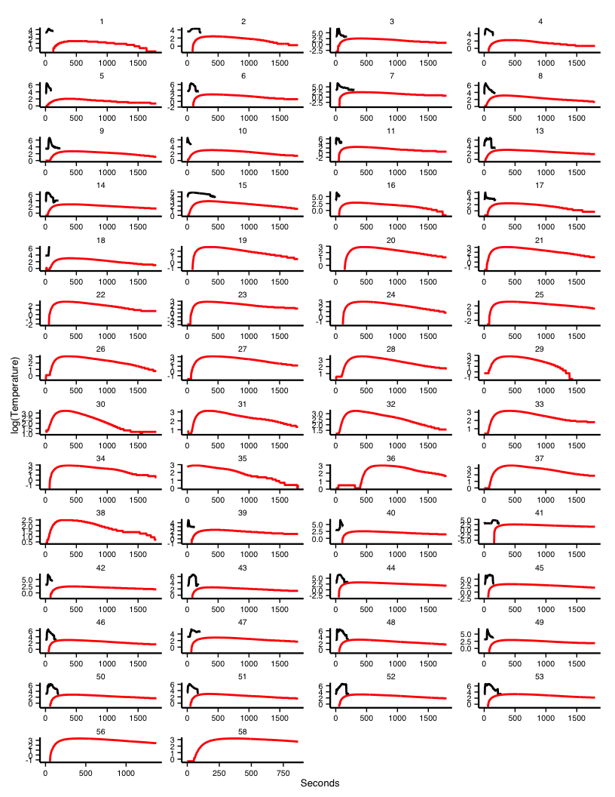

# Appendix
Godwin, D.S. and Holdo, R.M  
March 6, 2015  

# Figures

## Figure 1

 

# Tables

## Table 1

<html>
  <table cellspacing="0" style="border: none;">
    <caption align="bottom" style="margin-top:0.3em;">Residual Variance, Thermocouples</caption>
    <tr>
      <th style="text-align: left; border-top: 2px solid black; border-bottom: 1px solid black; padding-right: 12px;"></th>
      <th style="text-align: left; border-top: 2px solid black; border-bottom: 1px solid black; padding-right: 12px;"><b>TC Residuals ~ mean(Relative Humidity)</b></th>
      <th style="text-align: left; border-top: 2px solid black; border-bottom: 1px solid black; padding-right: 12px;"><b>TC Residuals ~ mean(Wind Speed)</b></th>
      <th style="text-align: left; border-top: 2px solid black; border-bottom: 1px solid black; padding-right: 12px;"><b>TC Residuals ~ max(Wind Speed)</b></th>
      <th style="text-align: left; border-top: 2px solid black; border-bottom: 1px solid black; padding-right: 12px;"><b>TC Residuals ~ min(RH)</b></th>
    </tr>
    <tr>
      <td style="padding-right: 12px; border: none;">(Intercept)</td>
      <td style="padding-right: 12px; border: none;">29.01 (104.28)</td>
      <td style="padding-right: 12px; border: none;">-104.12 (91.02)</td>
      <td style="padding-right: 12px; border: none;">-79.64 (91.47)</td>
      <td style="padding-right: 12px; border: none;">21.89 (102.87)</td>
    </tr>
    <tr>
      <td style="padding-right: 12px; border: none;">RH_mean</td>
      <td style="padding-right: 12px; border: none;">-0.81 (2.60)</td>
      <td style="padding-right: 12px; border: none;"></td>
      <td style="padding-right: 12px; border: none;"></td>
      <td style="padding-right: 12px; border: none;"></td>
    </tr>
    <tr>
      <td style="padding-right: 12px; border: none;">WS_mean</td>
      <td style="padding-right: 12px; border: none;"></td>
      <td style="padding-right: 12px; border: none;">57.35 (43.76)</td>
      <td style="padding-right: 12px; border: none;"></td>
      <td style="padding-right: 12px; border: none;"></td>
    </tr>
    <tr>
      <td style="padding-right: 12px; border: none;">WS_max</td>
      <td style="padding-right: 12px; border: none;"></td>
      <td style="padding-right: 12px; border: none;"></td>
      <td style="padding-right: 12px; border: none;">25.08 (25.09)</td>
      <td style="padding-right: 12px; border: none;"></td>
    </tr>
    <tr>
      <td style="padding-right: 12px; border: none;">RH_min</td>
      <td style="padding-right: 12px; border: none;"></td>
      <td style="padding-right: 12px; border: none;"></td>
      <td style="padding-right: 12px; border: none;"></td>
      <td style="padding-right: 12px; border: none;">-0.62 (2.63)</td>
    </tr>
    <tr>
      <td style="border-top: 1px solid black;">R2</td>
      <td style="border-top: 1px solid black;">0.00</td>
      <td style="border-top: 1px solid black;">0.05</td>
      <td style="border-top: 1px solid black;">0.03</td>
      <td style="border-top: 1px solid black;">0.00</td>
    </tr>
    <tr>
      <td style="padding-right: 12px; border: none;">Adj. R2</td>
      <td style="padding-right: 12px; border: none;">-0.03</td>
      <td style="padding-right: 12px; border: none;">0.02</td>
      <td style="padding-right: 12px; border: none;">0.00</td>
      <td style="padding-right: 12px; border: none;">-0.03</td>
    </tr>
    <tr>
      <td style="border-bottom: 2px solid black;">Num. obs.</td>
      <td style="border-bottom: 2px solid black;">32</td>
      <td style="border-bottom: 2px solid black;">32</td>
      <td style="border-bottom: 2px solid black;">32</td>
      <td style="border-bottom: 2px solid black;">32</td>
    </tr>
    <tr>
      <td style="padding-right: 12px; border: none;" colspan="5">\*\*\*p &lt; 0.001, \*\*p &lt; 0.01, \*p &lt; 0.05</td>
    </tr>
  </table>
</html>

## Table 2

<html>
  <table cellspacing="0" style="border: none;">
    <caption align="bottom" style="margin-top:0.3em;">Residual Variance, iButtons</caption>
    <tr>
      <th style="text-align: left; border-top: 2px solid black; border-bottom: 1px solid black; padding-right: 12px;"></th>
      <th style="text-align: left; border-top: 2px solid black; border-bottom: 1px solid black; padding-right: 12px;"><b>iButton Residuals ~ mean(Relative Humidity)</b></th>
      <th style="text-align: left; border-top: 2px solid black; border-bottom: 1px solid black; padding-right: 12px;"><b>iButton Residuals ~ mean(Wind Speed)</b></th>
      <th style="text-align: left; border-top: 2px solid black; border-bottom: 1px solid black; padding-right: 12px;"><b>iButton Residuals ~ max(Wind Speed)</b></th>
      <th style="text-align: left; border-top: 2px solid black; border-bottom: 1px solid black; padding-right: 12px;"><b>iButton Residuals ~ min(RH)</b></th>
    </tr>
    <tr>
      <td style="padding-right: 12px; border: none;">(Intercept)</td>
      <td style="padding-right: 12px; border: none;">-1.08 (1.60)</td>
      <td style="padding-right: 12px; border: none;">1.04 (1.40)</td>
      <td style="padding-right: 12px; border: none;">0.48 (1.42)</td>
      <td style="padding-right: 12px; border: none;">-1.06 (1.58)</td>
    </tr>
    <tr>
      <td style="padding-right: 12px; border: none;">RH_mean</td>
      <td style="padding-right: 12px; border: none;">0.03 (0.04)</td>
      <td style="padding-right: 12px; border: none;"></td>
      <td style="padding-right: 12px; border: none;"></td>
      <td style="padding-right: 12px; border: none;"></td>
    </tr>
    <tr>
      <td style="padding-right: 12px; border: none;">WS_mean</td>
      <td style="padding-right: 12px; border: none;"></td>
      <td style="padding-right: 12px; border: none;">-0.55 (0.69)</td>
      <td style="padding-right: 12px; border: none;"></td>
      <td style="padding-right: 12px; border: none;"></td>
    </tr>
    <tr>
      <td style="padding-right: 12px; border: none;">WS_max</td>
      <td style="padding-right: 12px; border: none;"></td>
      <td style="padding-right: 12px; border: none;"></td>
      <td style="padding-right: 12px; border: none;">-0.13 (0.39)</td>
      <td style="padding-right: 12px; border: none;"></td>
    </tr>
    <tr>
      <td style="padding-right: 12px; border: none;">RH_min</td>
      <td style="padding-right: 12px; border: none;"></td>
      <td style="padding-right: 12px; border: none;"></td>
      <td style="padding-right: 12px; border: none;"></td>
      <td style="padding-right: 12px; border: none;">0.03 (0.04)</td>
    </tr>
    <tr>
      <td style="border-top: 1px solid black;">R2</td>
      <td style="border-top: 1px solid black;">0.02</td>
      <td style="border-top: 1px solid black;">0.02</td>
      <td style="border-top: 1px solid black;">0.00</td>
      <td style="border-top: 1px solid black;">0.02</td>
    </tr>
    <tr>
      <td style="padding-right: 12px; border: none;">Adj. R2</td>
      <td style="padding-right: 12px; border: none;">-0.01</td>
      <td style="padding-right: 12px; border: none;">-0.01</td>
      <td style="padding-right: 12px; border: none;">-0.03</td>
      <td style="padding-right: 12px; border: none;">-0.01</td>
    </tr>
    <tr>
      <td style="border-bottom: 2px solid black;">Num. obs.</td>
      <td style="border-bottom: 2px solid black;">34</td>
      <td style="border-bottom: 2px solid black;">34</td>
      <td style="border-bottom: 2px solid black;">34</td>
      <td style="border-bottom: 2px solid black;">34</td>
    </tr>
    <tr>
      <td style="padding-right: 12px; border: none;" colspan="5">\*\*\*p &lt; 0.001, \*\*p &lt; 0.01, \*p &lt; 0.05</td>
    </tr>
  </table>
</html>
